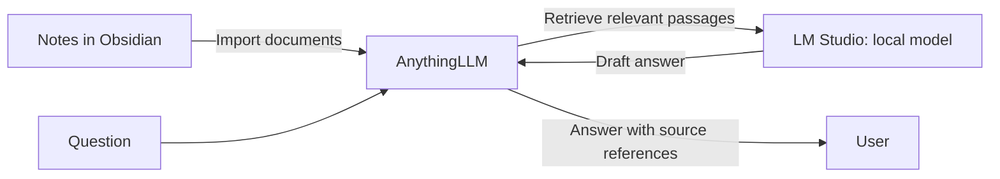

# Hi, I'm Filippo Agosti

**Full-stack developer at [ESTRO TECHNOLOGIES](https://estro.ai/), working in AWS environments and exploring practical AI applications.**

I work across frontend and backend development. At ESTRO TECHNOLOGIES, our team builds business software on AWS, including management applications and AI features. Examples of our work include systems that answer questions using database information and AI agents that research public information to enrich CRM data. I work with AWS services including RDS, Cognito and Lambda.

Here I share personal projects and experiments, including tools for fantasy football and a local AI knowledge assistant. The professional examples above are described at a general level, without client or project details.

**Portfolio:** [ago-filo.github.io](https://ago-filo.github.io/)

## Featured project

### [Fantamuretto](https://github.com/Ago-filo/Fantamuretto)

A browser-based workspace for managing a fantasy football auction: player rankings, personal valuations, budgets and competing team rosters.

- Plan player tiers and target prices before the auction.
- Track purchases, remaining budgets and available roster slots during the auction.
- Transfer auction plans through JSON files and manage player tiers through CSV imports and exports.
- Keep personal auction data in the browser through local storage.

Built with JavaScript, HTML and CSS, with a Node.js server for local use.

[Try Fantamuretto](https://ago-filo.github.io/Fantamuretto/) · [View source](https://github.com/Ago-filo/Fantamuretto)

## Interests

- Full-stack application development on AWS, including RDS, Cognito and Lambda.
- Retrieval-augmented generation (RAG), local language models and source-backed answers.
- Exploring the Model Context Protocol (MCP) for AI integrations.

## Current experiment: local second brain

I'm testing a personal knowledge workflow with Obsidian notes, AnythingLLM for document search and LM Studio for a local model. Early tests returned answers with document references; I'm now checking how reliably updated notes appear in search. I plan to publish a small, reproducible demo with example notes and evaluation questions.

This diagram shows the current manual document import workflow; automatic syncing is still being tested.

Find my public work in the repositories below.

